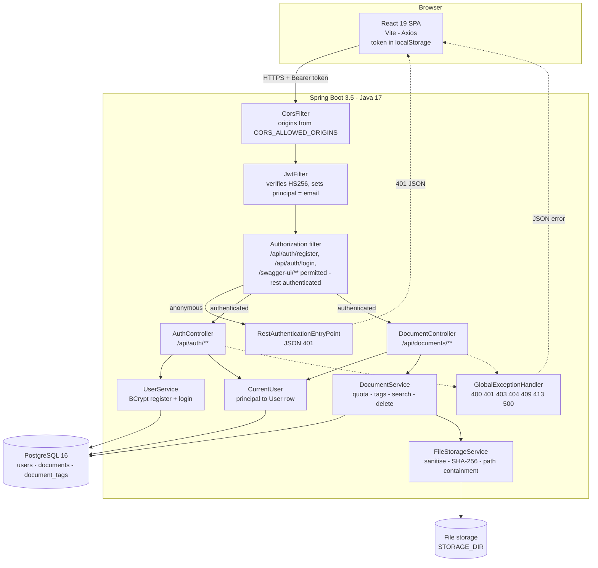

# Smart Digital Document Organizer

A self-hosted document vault. Register an account, upload files, tag them, and
find them again by name, tag, type or upload date — with every file scoped to the
account that uploaded it. The backend is a Spring Boot REST API that stores
metadata in PostgreSQL and file bytes on disk, authenticates with stateless JWTs,
enforces a per-user storage quota, and rejects duplicate uploads by SHA-256
checksum. The frontend is a React single-page app that exercises all of it.

[](https://github.com/vivekkumarq/document-organizer/actions/workflows/ci.yml)
[](https://adoptium.net/)
[](https://spring.io/projects/spring-boot)
[](https://react.dev/)
[](LICENSE)

---

## Table of contents

- [Screenshots](#screenshots)
- [Features](#features)
- [Architecture](#architecture)
- [Tech stack](#tech-stack)
- [Getting started](#getting-started)
  - [Prerequisites](#prerequisites)
  - [Clone and configure](#clone-and-configure)
  - [Run with Docker Compose](#run-with-docker-compose)
  - [Run manually](#run-manually)
- [API reference](#api-reference)
- [Configuration](#configuration)
- [Testing](#testing)
- [Project structure](#project-structure)
- [Roadmap](#roadmap)
- [License](#license)

---

## Screenshots


---

## Features

### Accounts and authentication

- Email and password registration with BCrypt hashing; the hash never leaves the
  database and no endpoint echoes it.
- Stateless JWT (HS256) issued at login, verified on every request by a servlet
  filter that populates the security context.
- The signing secret is read from configuration. If none is set, a random key is
  generated at startup with a warning, and a supplied secret shorter than 32
  characters is rejected before the application starts.
- Login failures return one 401 with an identical message whether the account is
  unknown or the password is wrong, so the endpoint cannot be used to enumerate
  registered addresses.

### Documents

- **Tags** — up to 10 per document, set at upload as a comma-separated value,
  normalised to lowercase, and filterable. The distinct tags a user has in play
  are exposed as their own endpoint so the UI can offer them.
- **Search and filter** — case-insensitive substring match on the filename,
  exact tag match, exact or prefix content type (`image/*`), and an upload date
  range. Filters combine with AND.
- **Pagination and sorting** — Spring Data `Pageable` behind a stable JSON
  envelope. Sortable by `uploadedAt`, `name`, `sizeBytes`, `contentType` or
  `id`; anything else falls back to `uploadedAt` rather than erroring. Page size
  is capped at 100.
- **Delete** — removes the database row and the file on disk, owner-scoped.
- **Download** — streams the file with its original filename and content type,
  owner-scoped.

### Storage safety

- **Per-user quota**, configurable application-wide with an optional per-user
  override. Enforced at upload; an upload that would cross the line is refused
  with 413 before anything is written.
- **Usage endpoint** reporting total files, bytes used, quota, bytes remaining,
  percentage used, and a breakdown by content type.
- **Upload hardening** — a maximum single-file size, a content-type allowlist,
  and filename sanitisation that strips directory components (both separators),
  control characters and leading dots. Files are written under a generated UUID
  name, and every resolved path is checked to still sit under the storage root,
  so a filename like `../../../etc/passwd` cannot escape it.
- **Duplicate detection** — a SHA-256 checksum is computed and stored at upload;
  re-uploading identical bytes returns 409 and leaves a single copy on disk.

### Everything else

- OpenAPI 3 spec generated from annotated controllers, with Swagger UI served at
  `/swagger-ui.html`.
- Consistent JSON error bodies (`timestamp`, `status`, `error`, `message`,
  `path`) with meaningful status codes: 400, 401, 403, 404, 409, 413, 500.
  Unexpected exceptions are logged server-side and reported as a generic 500.
- 49 JUnit 5 tests running against in-memory H2, so the suite needs no database.
- Configuration is entirely environment-driven with sane defaults; nothing is
  hardcoded to one machine.

---

## Architecture



Two properties hold throughout: the owner of a request is always the subject of
the verified token, never an id supplied by the client; and no path derived from
a client-supplied filename is used before it has been normalised and confirmed to
resolve inside the storage root.

---

## Tech stack

| Layer | Technology | Version |
| --- | --- | --- |
| Language | Java | 17 |
| Framework | Spring Boot | 3.5.11 |
| Security | Spring Security + jjwt | Boot-managed / 0.11.5 |
| Persistence | Spring Data JPA / Hibernate | Boot-managed |
| Database | PostgreSQL | 16 (Compose image) |
| Test database | H2 (in-memory) | Boot-managed |
| API docs | springdoc-openapi | 2.8.13 |
| Build | Maven Wrapper | 3.9.12 |
| UI library | React + React DOM | 19.2 |
| Bundler | Vite | 7.3 |
| HTTP client | Axios | 1.13 |
| Linter | ESLint (flat config) | 9.39 |
| UI runtime | Node.js | 20 in CI (24 also works) |
| Web server (image) | nginx | 1.27-alpine |
| Testing | JUnit 5, Spring Boot Test, MockMvc, AssertJ, Mockito | Boot-managed |

---

## Getting started

### Prerequisites

| To run it… | You need |
| --- | --- |
| With Docker Compose | Docker Engine 24+ with the Compose plugin |
| Manually | JDK 17, Node.js 20+, PostgreSQL 14+ running locally |

Maven is not required: the repository ships the Maven Wrapper (`./mvnw`).

### Clone and configure

```bash
git clone https://github.com/vivekkumarq/document-organizer.git
cd document-organizer
cp .env.example .env
```

Then edit `.env` and set a real `JWT_SECRET` — at least 32 characters. The
backend refuses to start with a shorter one, and Compose refuses to start
without one at all.

```bash
# A convenient way to generate one:
openssl rand -base64 48
```

### Run with Docker Compose

```bash
docker compose up --build
```

This starts PostgreSQL, builds and runs the API, and serves the built frontend
through nginx.

| Service | URL |
| --- | --- |
| Frontend | <http://localhost:5173> |
| API | <http://localhost:8080> |
| Swagger UI | <http://localhost:8080/swagger-ui.html> |

Documents live in the `docorganizer_storage` named volume and the database in
`docorganizer_db`, so both survive `docker compose down`. To wipe them:

```bash
docker compose down -v
```

> **Note:** the Docker and Compose files in this repository have not been built
> or run — Docker was not installed in the environment they were written in.
> They are provided as-is. The manual path below has been run end to end.

### Run manually

**1. Create the database.**

```bash
createdb -U postgres docorganizer
# or: psql -U postgres -c "CREATE DATABASE docorganizer;"
```

Tables are created automatically on first start (`JPA_DDL_AUTO=update`).

**2. Start the backend.**

```bash
cd docorganizer

export DB_URL="jdbc:postgresql://localhost:5432/docorganizer"
export DB_USERNAME=postgres
export DB_PASSWORD=postgres
export JWT_SECRET="replace-with-at-least-32-random-characters"
export STORAGE_DIR="../storage"

./mvnw spring-boot:run
```

On Windows PowerShell use `$env:DB_URL="..."` in place of `export`.

The API comes up on <http://localhost:8080>. Every variable has a default, so
`./mvnw spring-boot:run` on its own also works if PostgreSQL is reachable at
`localhost:5432/docorganizer` with `postgres`/`postgres`; a random JWT key is
then generated at startup and logged as a warning.

**3. Start the frontend.** In a second terminal:

```bash
cd docorganizer-ui
npm install
npm run dev
```

The dev server runs on <http://localhost:5173>, which is already in the default
`CORS_ALLOWED_ORIGINS`. If your API is not on `localhost:8080`, copy
`docorganizer-ui/.env.example` to `docorganizer-ui/.env` and set
`VITE_API_BASE_URL`.

---

## API reference

Every path is relative to the API base (`http://localhost:8080` by default).
Authenticated endpoints expect `Authorization: Bearer <token>`.

| Method | Path | Auth | Description |
| --- | --- | :---: | --- |
| `POST` | `/api/auth/register` | – | Create an account. Returns the new profile (201). |
| `POST` | `/api/auth/login` | – | Exchange credentials for a JWT. |
| `GET` | `/api/auth/me` | yes | Profile behind the supplied token. |
| `GET` | `/api/documents` | yes | List the caller's documents; paginated, sortable, filterable. |
| `POST` | `/api/documents/upload` | yes | Upload a file with optional tags (201). |
| `GET` | `/api/documents/{id}` | yes | Metadata for one owned document. |
| `GET` | `/api/documents/{id}/download` | yes | Stream the file bytes. |
| `DELETE` | `/api/documents/{id}` | yes | Delete the row and the file on disk (204). |
| `GET` | `/api/documents/tags` | yes | Distinct tags used by the caller. |
| `GET` | `/api/documents/stats` | yes | Storage usage, quota and breakdown by type. |
| `GET` | `/swagger-ui.html` | – | Swagger UI (redirects to `/swagger-ui/index.html`). |
| `GET` | `/v3/api-docs` | – | OpenAPI 3 document as JSON. |

Documents owned by another account return **404**, not 403 — the API does not
confirm that an id it will not serve exists.

### Query parameters for `GET /api/documents`

| Parameter | Type | Default | Description |
| --- | --- | --- | --- |
| `filename` | string | – | Case-insensitive substring match on the filename. |
| `tag` | string | – | Exact tag match, case-insensitive. |
| `contentType` | string | – | Exact type, or a prefix such as `image/*`. |
| `uploadedAfter` | date (`yyyy-MM-dd`) | – | On or after this date. |
| `uploadedBefore` | date (`yyyy-MM-dd`) | – | On or before this date. |
| `page` | int | `0` | Zero-based page index. |
| `size` | int | `10` | Page size, capped at 100. |
| `sort` | string | `uploadedAt` | `uploadedAt`, `name`, `sizeBytes`, `contentType` or `id`. |
| `direction` | string | `desc` | `asc` or `desc`. |

### Examples

**Register**

```http
POST /api/auth/register
Content-Type: application/json

{ "name": "Vivek Kumar", "email": "vivek@example.com", "password": "correct-horse-battery" }
```

```json
{
  "id": 1,
  "name": "Vivek Kumar",
  "email": "vivek@example.com",
  "role": "USER",
  "createdAt": "2026-08-29T13:30:12.884"
}
```

**Login**

```http
POST /api/auth/login
Content-Type: application/json

{ "email": "vivek@example.com", "password": "correct-horse-battery" }
```

```json
{
  "token": "eyJhbGciOiJIUzI1NiJ9.eyJzdWIiOiJ2aXZlay...",
  "tokenType": "Bearer",
  "expiresInMs": 86400000,
  "user": {
    "id": 1,
    "name": "Vivek Kumar",
    "email": "vivek@example.com",
    "role": "USER",
    "createdAt": "2026-08-29T13:30:12.884"
  }
}
```

**Upload**

```bash
curl -X POST http://localhost:8080/api/documents/upload \
  -H "Authorization: Bearer $TOKEN" \
  -F "file=@invoice-2026-q1.pdf" \
  -F "tags=invoice,2026,finance"
```

```json
{
  "id": 4,
  "name": "invoice-2026-q1.pdf",
  "contentType": "application/pdf",
  "sizeBytes": 96,
  "checksumSha256": "634be63cc8a228e7970171c28f9ac85b1212a091893f6f7c5e058cbfddcdd08a",
  "tags": ["invoice", "2026", "finance"],
  "uploadedAt": "2026-08-29T13:32:07.194"
}
```

**List with filters**

```bash
curl "http://localhost:8080/api/documents?tag=finance&sort=name&direction=asc&page=0&size=10" \
  -H "Authorization: Bearer $TOKEN"
```

```json
{
  "content": [
    {
      "id": 4,
      "name": "invoice-2026-q1.pdf",
      "contentType": "application/pdf",
      "sizeBytes": 96,
      "checksumSha256": "634be63cc8a228e7970171c28f9ac85b1212a091893f6f7c5e058cbfddcdd08a",
      "tags": ["2026", "finance", "invoice"],
      "uploadedAt": "2026-08-29T13:32:07.194"
    }
  ],
  "page": 0,
  "size": 10,
  "totalElements": 1,
  "totalPages": 1,
  "first": true,
  "last": true
}
```

**Storage stats**

```bash
curl http://localhost:8080/api/documents/stats -H "Authorization: Bearer $TOKEN"
```

```json
{
  "totalFiles": 5,
  "bytesUsed": 578,
  "quotaBytes": 104857600,
  "bytesRemaining": 104857022,
  "percentUsed": 0.0,
  "byContentType": [
    { "contentType": "text/plain", "fileCount": 4, "bytesUsed": 400 },
    { "contentType": "image/png", "fileCount": 1, "bytesUsed": 178 }
  ]
}
```

**Error shape** — every failure uses the same body:

```json
{
  "timestamp": "2026-08-29T08:00:45.603572200Z",
  "status": 409,
  "error": "Conflict",
  "message": "An identical file is already stored as \"report.txt\"",
  "path": "/api/documents/upload"
}
```

---

## Configuration

All backend settings are read from environment variables with the defaults
below. `.env.example` is the canonical list; `docker-compose.yml` reads it
automatically.

| Variable | Description | Default |
| --- | --- | --- |
| `DB_URL` | JDBC URL of the PostgreSQL database | `jdbc:postgresql://localhost:5432/docorganizer` |
| `DB_USERNAME` | Database user | `postgres` |
| `DB_PASSWORD` | Database password | `postgres` |
| `JPA_DDL_AUTO` | Hibernate schema handling (`update`, `validate`, `none`) | `update` |
| `JPA_SHOW_SQL` | Log generated SQL | `false` |
| `SERVER_PORT` | Port the API listens on | `8080` |
| `JWT_SECRET` | HS256 signing secret; must be at least 32 characters. Empty generates a random key at startup (dev only) | *(empty)* |
| `JWT_EXPIRATION_MS` | Token lifetime in milliseconds | `86400000` (24 h) |
| `CORS_ALLOWED_ORIGINS` | Comma-separated browser origins allowed to call the API | `http://localhost:5173,http://localhost:5174` |
| `STORAGE_DIR` | Directory documents are written to | `../storage` |
| `STORAGE_QUOTA_BYTES` | Default per-user storage allowance | `104857600` (100 MiB) |
| `STORAGE_MAX_FILE_SIZE_BYTES` | Largest single upload accepted | `10485760` (10 MiB) |
| `STORAGE_ALLOWED_CONTENT_TYPES` | Comma-separated MIME allowlist; empty accepts anything | PDF, PNG, JPEG, GIF, WebP, plain text, CSV, Word, Excel |
| `MAX_UPLOAD_SIZE` | Servlet multipart file limit; keep above `STORAGE_MAX_FILE_SIZE_BYTES` | `16MB` |
| `MAX_REQUEST_SIZE` | Servlet multipart request limit | `20MB` |
| `LOG_LEVEL` | Log level for `com.vivek.docorganizer` | `INFO` |

The frontend has one build-time variable. Vite inlines `VITE_*` at build time,
so changing it requires a rebuild rather than a restart.

| Variable | Description | Default |
| --- | --- | --- |
| `VITE_API_BASE_URL` | Base URL of the API | `http://localhost:8080` |

Compose additionally uses `POSTGRES_DB`, `POSTGRES_USER` and
`POSTGRES_PASSWORD` to provision the database container.

---

## Testing

The backend suite uses an in-memory H2 database through the `test` profile, so
no PostgreSQL instance is needed.

```bash
cd docorganizer
./mvnw -B clean verify
```

49 tests across six classes:

| Class | Tests | Covers |
| --- | :---: | --- |
| `AuthControllerTest` | 9 | Registration, duplicate email, validation, login, wrong password, unknown account, `/me`, tampered tokens |
| `DocumentControllerTest` | 21 | Upload validation, filename sanitisation, duplicate detection, quota enforcement, owner scoping on list/read/download/delete, delete removing the file from disk, search by name/tag/type/date, pagination and sorting |
| `FileStorageServiceTest` | 12 | Filename sanitisation cases, path-containment refusals, checksum correctness |
| `UserServiceTest` | 4 | Password hashing, email normalisation, credential checks |
| `OpenApiDocsTest` | 2 | The generated spec is public and documents every endpoint in the table above |
| `DocorganizerApplicationTests` | 1 | The application context starts under the test profile |

Frontend checks:

```bash
cd docorganizer-ui
npm install
npm run lint
npm run build
```

CI runs exactly these commands on every push and pull request.

---

## Project structure

```
document-organizer/
├── .github/workflows/ci.yml       # Backend + frontend CI
├── docker-compose.yml             # Postgres + API + UI, named volumes
├── .env.example                   # Every environment variable, documented
├── docs/screenshots/              # README images
├── storage/                       # Uploaded files at runtime (git-ignored)
│
├── docorganizer/                  # Spring Boot API
│   ├── Dockerfile                 # Maven build -> JRE 17 runtime
│   ├── pom.xml
│   └── src
│       ├── main
│       │   ├── java/com/vivek/docorganizer
│       │   │   ├── config/        # Security, CORS, OpenAPI, @ConfigurationProperties
│       │   │   ├── controller/    # AuthController, DocumentController
│       │   │   ├── dto/           # Requests + response records
│       │   │   ├── entity/        # User, Document
│       │   │   ├── exception/     # Domain exceptions + global handler
│       │   │   ├── repository/    # Spring Data repos + search specifications
│       │   │   ├── security/      # JwtUtil, JwtFilter, CurrentUser, entry point
│       │   │   └── service/       # UserService, DocumentService, FileStorageService
│       │   └── resources/application.yaml
│       └── test
│           ├── java/com/vivek/docorganizer/    # 49 JUnit 5 tests
│           └── resources/application-test.yaml # H2 test profile
│
└── docorganizer-ui/               # React SPA
    ├── Dockerfile                 # Vite build -> nginx
    ├── nginx.conf
    └── src
        ├── api/api.js             # Axios instance, token handling, interceptors
        ├── components/            # DocumentList, UploadForm, StorageMeter
        ├── pages/                 # Login, Dashboard
        ├── utils/format.js
        └── styles.css
```

---

## Roadmap

- Refresh tokens and token revocation; today a JWT is valid until it expires.
- Full-text search inside document contents (PDF and plain-text extraction).
- Document expiry dates with reminders before a document goes stale.
- Sharing a document with another account through a scoped, expiring link.
- Server-side thumbnail generation and image previews in the list.
- S3-compatible object storage as an alternative to the local filesystem.
- Flyway migrations, replacing `ddl-auto: update`.
- Rate limiting on the authentication endpoints.

---

## License

Released under the [MIT License](LICENSE). Copyright © 2026 Vivek Kumar.
